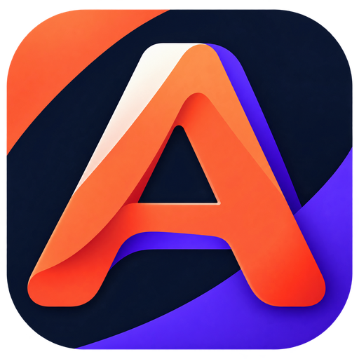
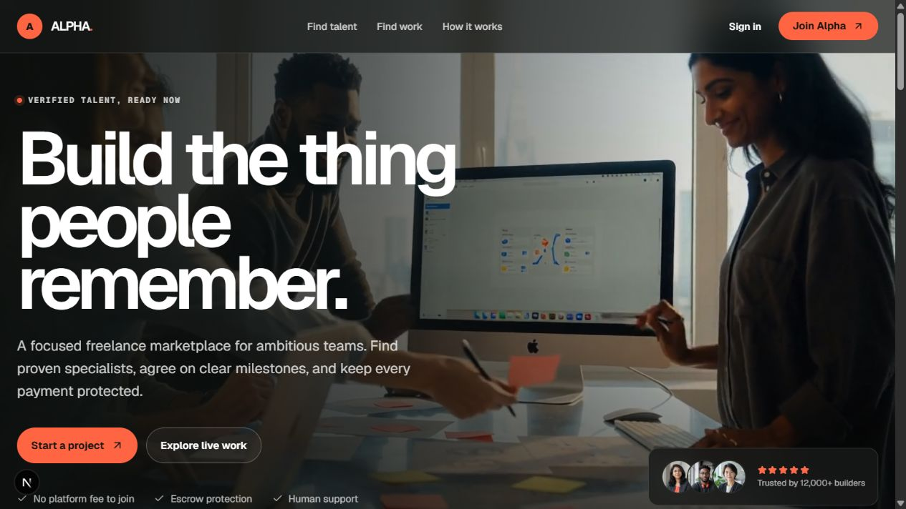
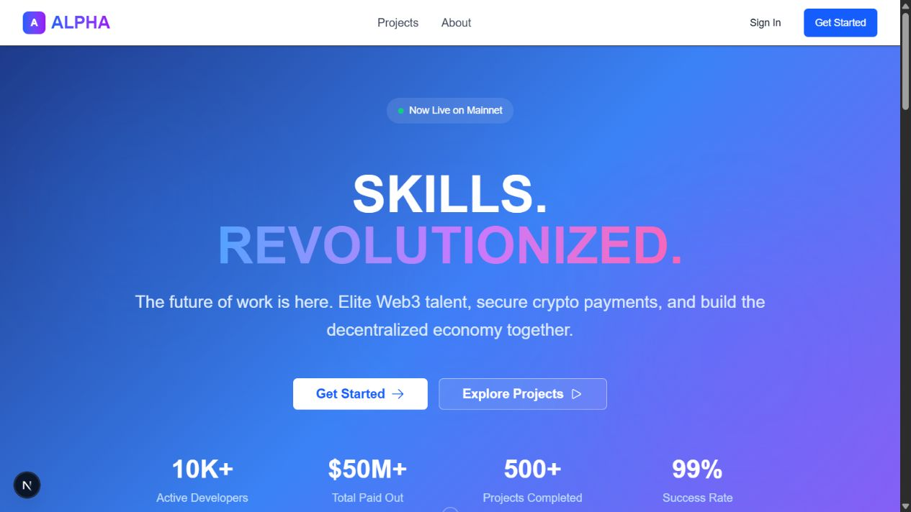
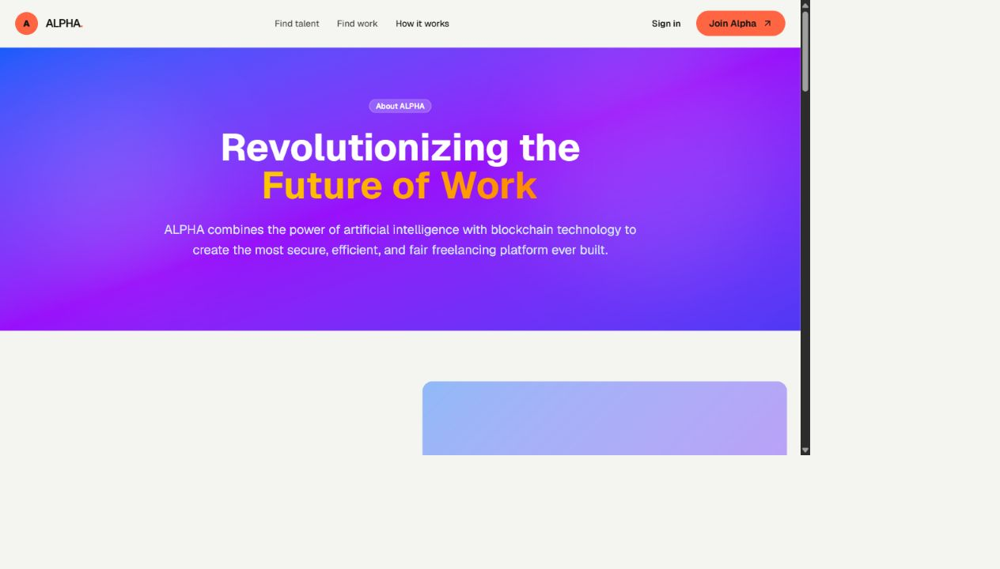
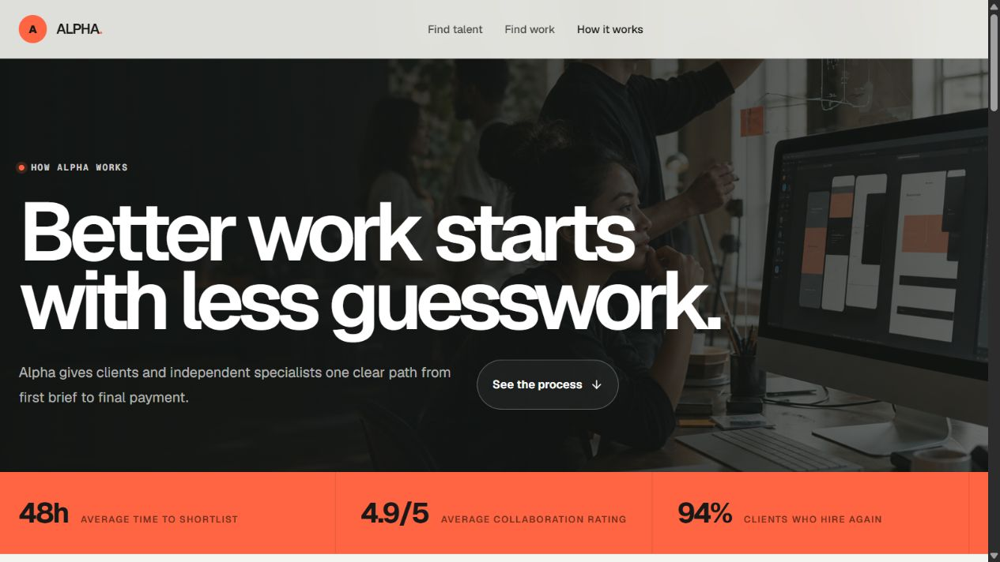
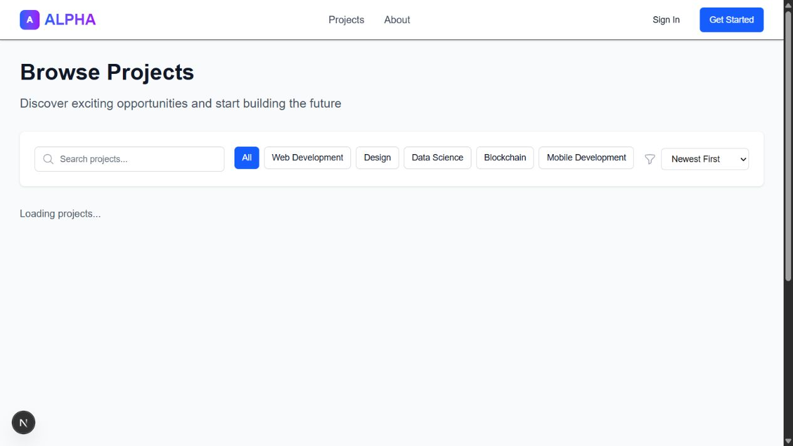
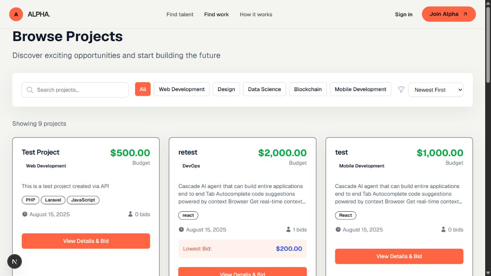
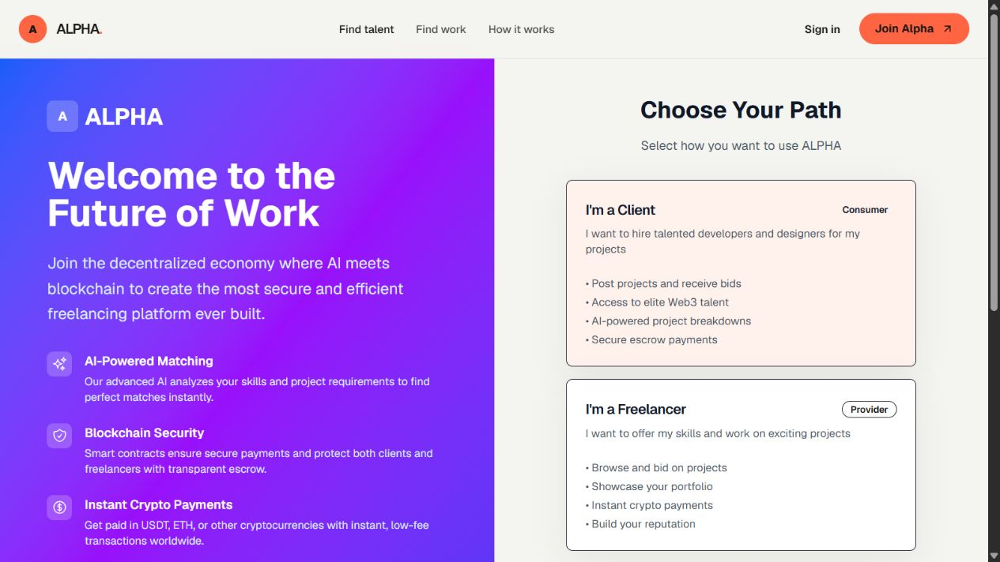
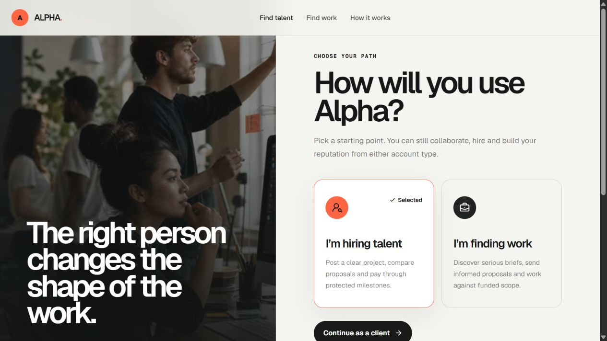

<div align="center">
  

  # Alpha Freelance Platform

  **A modern full-stack marketplace where clients publish work, specialists bid, and projects move from idea to completion.**

  [](https://alpha-web-2146.onrender.com)
  [](https://alpha-api-yewi.onrender.com/up)
  [](https://nextjs.org/)
  [](https://laravel.com/)

  [Live website](https://alpha-web-2146.onrender.com) · [Browse projects](https://alpha-web-2146.onrender.com/projects) · [API health](https://alpha-api-yewi.onrender.com/up) · [Documentation](docs/)
</div>

---



## What is Alpha?

Alpha is a portfolio-ready freelance marketplace built as a Laravel API and a Next.js application. It supports separate client, freelancer, and administrator experiences while keeping the interface approachable, responsive, and visually distinctive.

Clients can publish projects and manage bids. Freelancers can discover opportunities, submit proposals, maintain profiles, and track their activity. Administrators receive tools for users, projects, disputes, payments, and reporting.

> **Hosted demo:** Render's free services sleep after inactivity. The first visit can take around a minute while the services wake up.

## Highlights

- **Role-based accounts** for clients, freelancers, and administrators
- **Project marketplace** with search, categories, skills, budgets, and sorting
- **Proposal workflow** for creating, updating, accepting, and withdrawing bids
- **Profiles and reputation** with skills, biographies, ratings, and reviews
- **Project operations** including statuses, deadlines, AI breakdown fields, and research data
- **Dispute management** with evidence, messages, and administrative resolution
- **Wallet and escrow demo** for illustrating payment-related workflows
- **Administration suite** for users, projects, payments, reports, and platform statistics
- **Responsive redesign** with custom artwork, profiles, motion, video, and branding
- **Persistent PostgreSQL data** hosted on Neon

## Before and after

The project began with a functional but generic interface. The redesign introduced a warmer visual system, stronger typography, clearer hierarchy, custom imagery, richer landing-page storytelling, and consistent Alpha branding.

### Homepage

| Before | After |
|:---:|:---:|
|  |  |

### How it works

| Before | After |
|:---:|:---:|
|  |  |

### Project marketplace

| Before | After |
|:---:|:---:|
|  |  |

### Talent onboarding

| Before | After |
|:---:|:---:|
|  |  |

## Brand and generated media

<p align="center">
  
</p>

The redesign includes a generated Alpha favicon, custom marketplace artwork, original profile images, and a short visual loop. Project media is stored in [`frontend/public/media`](frontend/public/media/).

## Technology

| Layer | Technologies |
|---|---|
| Frontend | Next.js 15, React 19, TypeScript, Tailwind CSS 4, Framer Motion |
| UI | Headless UI, Radix UI, Lucide, Swiper |
| Backend | Laravel 12, PHP 8.3, Laravel Sanctum |
| Database | PostgreSQL 17 on Neon |
| Deployment | Docker, Render, GitHub auto-deployments |
| Documents | DomPDF, Laravel Excel |

## Architecture

```text
Browser
   │
   ▼
Next.js frontend (Render)
   │  Same-origin /api/backend/* proxy
   ▼
Laravel REST API (Render)
   │
   ▼
Neon PostgreSQL
```

The frontend proxy keeps the API address configurable at runtime and prevents production client bundles from depending on a hard-coded backend URL. Laravel uses a pooled Neon connection for application traffic and a direct connection for migrations.

## Repository layout

```text
├── frontend/                 Next.js application
│   ├── public/media/         Generated images and video
│   └── src/app/              Routes, favicon, and app icon
├── backend/                  Laravel API
│   ├── app/                  Controllers, models, and middleware
│   ├── database/             Migrations and demo seeder
│   └── routes/api.php        REST endpoints
├── artifacts/screenshots/    Before and after visual captures
├── docs/                     Setup, API, deployment, and project documents
└── render.yaml               Free-tier deployment blueprint
```

## Run locally

### Requirements

- Node.js 20+
- PHP 8.2+
- Composer 2
- SQLite for the simplest local setup, or PostgreSQL

### 1. Clone

```bash
git clone https://github.com/ronithrashmikara/alpha-freelance-platform-enhanced.git
cd alpha-freelance-platform-enhanced
```

### 2. Start the Laravel API

```bash
cd backend
composer install
cp .env.example .env
php artisan key:generate
```

Create the local SQLite file if it does not already exist:

```bash
# macOS/Linux
touch database/database.sqlite

# PowerShell
New-Item database/database.sqlite -ItemType File -Force
```

Then migrate, seed, and start Laravel:

```bash
php artisan migrate --seed
php artisan serve
```

The API runs at `http://127.0.0.1:8000`.

### 3. Start the Next.js frontend

Open another terminal:

```bash
cd frontend
npm install
npm run dev
```

Open [http://localhost:3000](http://localhost:3000). The built-in same-origin proxy connects to the local Laravel API automatically.

## Demo accounts

| Experience | Email | Password |
|---|---|---|
| Client | `sarah@example.com` | `demo123` |
| Freelancer | `marcus@example.com` | `demo123` |
| Freelancer | `emily@example.com` | `demo123` |
| Freelancer | `david@example.com` | `demo123` |
| Administrator | `admin@alpha.com` | `admin123` |

These credentials are for demonstration only. Replace them before using the project in a real environment.

## Useful commands

```bash
# Frontend production build
cd frontend && npm run build

# Backend tests
cd backend && php artisan test

# Reset and reseed the local database
cd backend && php artisan migrate:fresh --seed
```

## Deployment

The application currently runs as two **free Render web services** in Singapore:

- Frontend: [`alpha-web`](https://alpha-web-2146.onrender.com)
- Backend: [`alpha-api`](https://alpha-api-yewi.onrender.com)
- Database: Neon PostgreSQL

Every commit to `master` automatically deploys the relevant service. See [`docs/DEPLOYMENT.md`](docs/DEPLOYMENT.md) and [`render.yaml`](render.yaml) for the full configuration.

## Important project notes

- Wallet, deposits, withdrawals, and escrow are demonstration workflows. They do not transfer real currency or blockchain assets.
- Uploaded files require external object storage for durable production use because free Render filesystems are ephemeral.
- The project is intended as a hobby project, portfolio piece, and full-stack learning reference.

## Documentation

Detailed material lives in [`docs/`](docs/), including:

- [API documentation](docs/API_DOCUMENTATION.md)
- [Setup guide](docs/SETUP_GUIDE.md)
- [Deployment guide](docs/DEPLOYMENT.md)
- [Administrator features](docs/ADMIN_FEATURES.md)
- [Software requirements](docs/SOFTWARE_REQUIREMENTS_SPECIFICATION.md)
- [Development journey](docs/DEVELOPMENT_JOURNEY.md)
- [Sitemap](docs/SITEMAP.md)

---

<div align="center">
  <strong>Designed and built as a complete freelance marketplace learning project.</strong>
  <br /><br />
  <a href="https://alpha-web-2146.onrender.com">Explore Alpha →</a>
</div>
