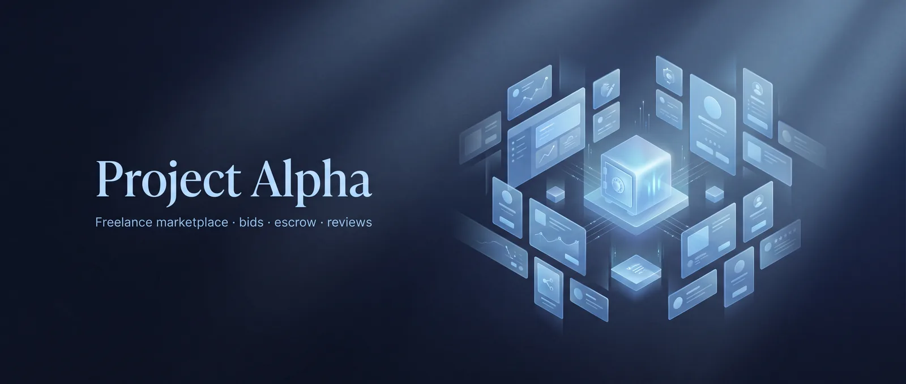
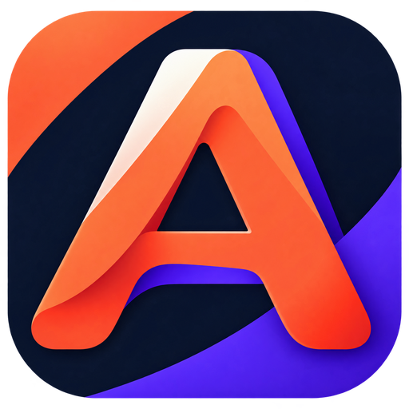
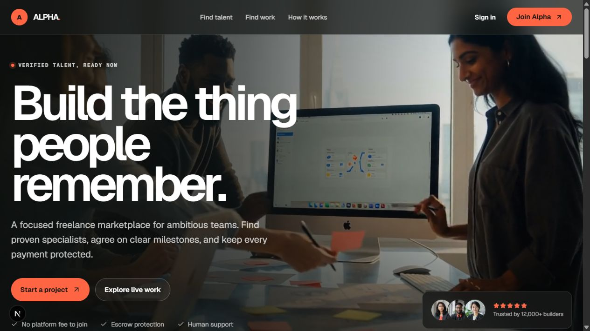
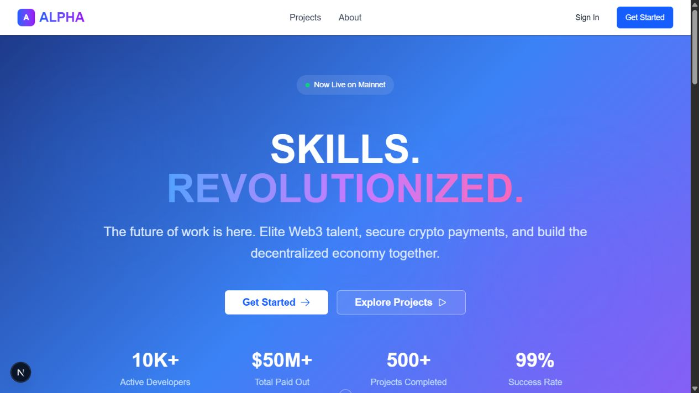
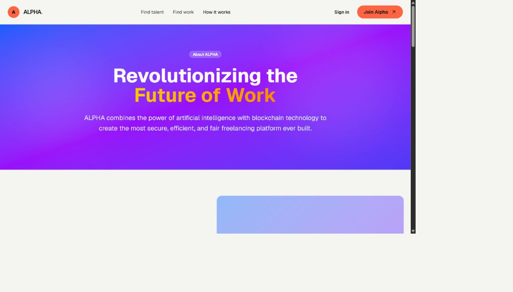
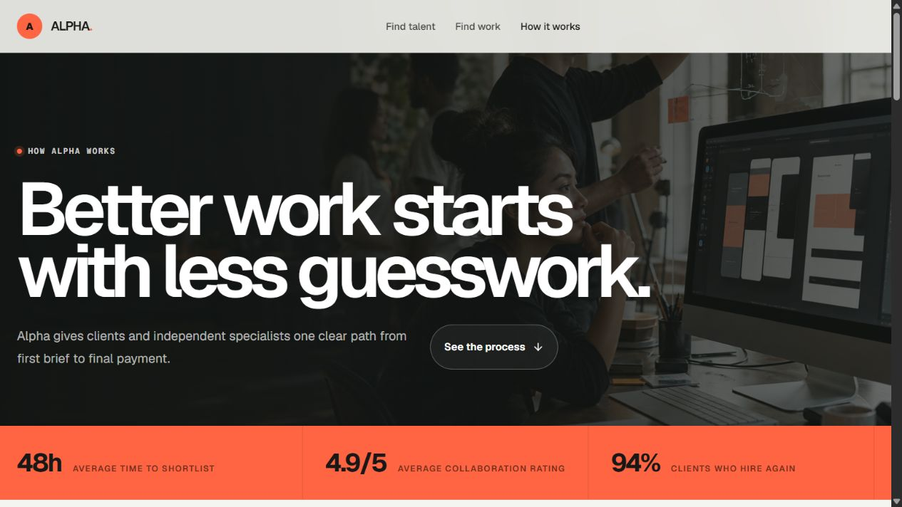
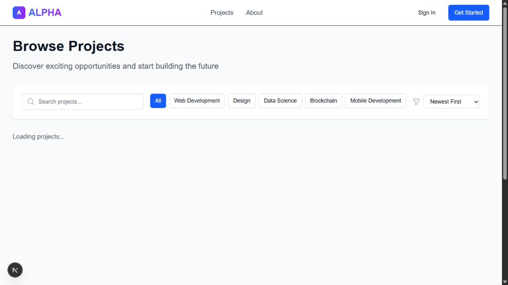
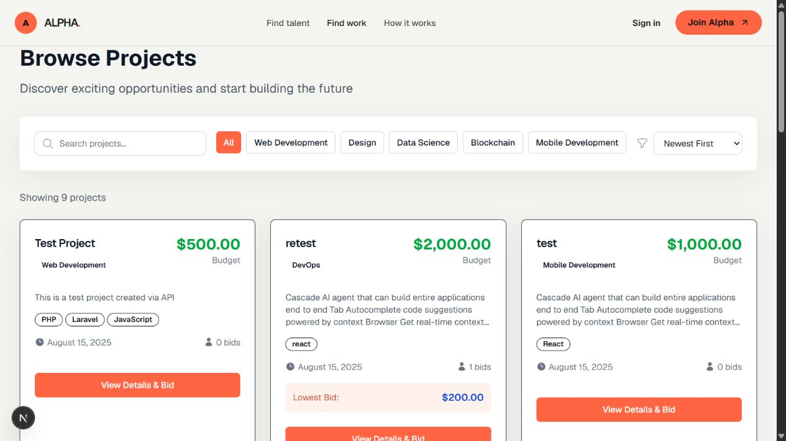
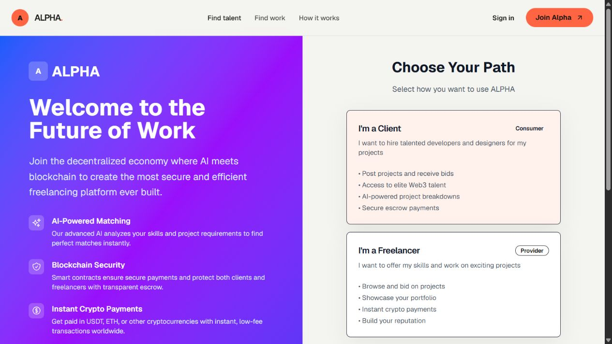
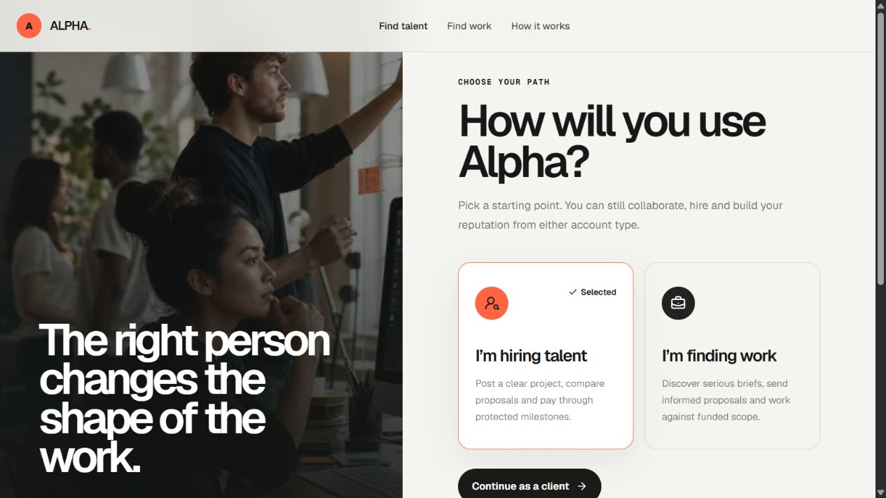

<p align="center">
  
</p>

<div align="center">
  

  # Alpha Freelance Platform

  **A modern full-stack marketplace where clients publish work, specialists bid, and projects move from idea to completion.**

  [](https://alpha-web-2146.onrender.com)
  [](https://alpha-api-yewi.onrender.com/up)
  [](https://github.com/ronithrashmikara/alpha-freelance-platform-enhanced/actions/workflows/tests.yml)
  [](https://nextjs.org/)
  [](https://laravel.com/)

  [Live website](https://alpha-web-2146.onrender.com) · [Browse projects](https://alpha-web-2146.onrender.com/projects) · [API health](https://alpha-api-yewi.onrender.com/up) · [Documentation](docs/)
</div>

---



## What is Alpha?

Alpha is a portfolio-ready freelance marketplace built as a Laravel API and a Next.js application. It supports separate client, freelancer, and administrator experiences while keeping the interface approachable, responsive, and visually distinctive.

Clients can publish projects and manage bids. Freelancers can discover opportunities, submit proposals, maintain profiles, and track their activity. Administrators receive tools for users, projects, disputes, payments, and reporting.

> **Hosted demo:** both services run on Render's free tier, which puts them to sleep after inactivity. The first request after a quiet spell can take roughly 30–60 seconds while the API and the web app wake up; after that, pages respond normally.

## Highlights

- **Role-based accounts** for clients, freelancers, and administrators
- **Project marketplace** with search, categories, skills, budgets, and sorting
- **Proposal workflow** for creating, updating, accepting, and withdrawing bids
- **Profiles and reputation** with skills, biographies, ratings, and reviews
- **Project operations** including statuses, deadlines, AI breakdown fields, and research data
- **Dispute management** with evidence, messages, and administrative resolution
- **Simulated escrow**: a state machine over an in-app wallet ledger, with no payment provider (see [Escrow and payments](#escrow-and-payments-simulated))
- **Administration suite** for users, projects, payments, reports, and platform statistics
- **Responsive redesign** with custom artwork, profiles, motion, video, and branding
- **Persistent PostgreSQL data** hosted on Neon

## Project history

This repository was created on 2026-08-21 by importing the Alpha platform baseline (commit `7e8d824`, "chore: import Alpha platform baseline") and then redesigning it: the other commits that day cover the marketplace redesign, generated media, onboarding, and moving deployment to Render and Neon. Development history from before the import is not in this repository, so the git log does not show how the baseline itself was built.

## Before and after

The project began with a functional but generic interface. The redesign introduced a warmer visual system, stronger typography, clearer hierarchy, custom imagery, richer landing-page storytelling, and consistent Alpha branding.

### Homepage

| Before | After |
|:---:|:---:|
|  |  |

### How it works

| Before | After |
|:---:|:---:|
|  |  |

### Project marketplace

| Before | After |
|:---:|:---:|
|  |  |

### Talent onboarding

| Before | After |
|:---:|:---:|
|  |  |

## Brand and generated media

<p align="center">
  
</p>

The redesign includes a generated Alpha favicon, custom marketplace artwork, original profile images, and a short visual loop. Project media is stored in [`frontend/public/media`](frontend/public/media/).

## Technology

| Layer | Technologies |
|---|---|
| Frontend | Next.js 15, React 19, TypeScript, Tailwind CSS 4, Framer Motion |
| UI | Headless UI, Radix UI, Lucide, Swiper |
| Backend | Laravel 12, PHP 8.3, Laravel Sanctum |
| Database | PostgreSQL 17 on Neon |
| Deployment | Docker, Render, GitHub auto-deployments |
| Documents | DomPDF, Laravel Excel |

## Architecture

```text
Browser
   │
   ▼
Next.js frontend (Render)
   │  Same-origin /api/backend/* proxy
   ▼
Laravel REST API (Render)
   │
   ▼
Neon PostgreSQL
```

The frontend proxy keeps the API address configurable at runtime and prevents production client bundles from depending on a hard-coded backend URL. Laravel uses a pooled Neon connection for application traffic and a direct connection for migrations.

## Escrow and payments (simulated)

No payment provider, bank or blockchain is involved. Each user has a `wallets` row whose `balance_usdt` is just a number (new accounts start with 20 USDT of demo credit); wallet "addresses" and "transaction hashes" are random hex strings; and every money movement is a row in `payments`. The states below are the ones the controllers actually set (`BidController`, `PaymentController`, `DisputeController`).

**Project** (`projects.status`)

```text
open ──(owner accepts a bid, or a bid ≤ 80% of budget is auto-accepted)──▶ in_progress
in_progress ──(assigned freelancer marks it done)──▶ completed
in_progress ──(admin processes a refund)──▶ cancelled
```

**Bid** (`bids.status`): `pending` → `accepted`, and every other bid on the project → `rejected`. A `pending` bid can be withdrawn (deleted) by its author.

**Escrow payment** (`payments.type = escrow`)

```text
(none) ──(client funds it: accepted bid amount debited from the client's wallet)──▶ held
held ──(client releases it after the project is completed: freelancer's wallet credited)──▶ completed
held ──(client requests a refund, with a reason)──▶ refund_requested ──(admin)──▶ refunded
```

The refund branch exists in the code but does not currently work on PostgreSQL: `refund_requested` is not one of the values the `payments.status` column allows (see [Known issues](#known-issues)). The wallet's `escrow_balance` column is never updated; money in escrow exists only as the `held` payment row. Deposits and withdrawals are also simulated (crypto deposits are auto-approved).

**Dispute** (`disputes.status`): `open` → `in_review` → `resolved` (admin, with a written resolution) → `closed` (by either party). Posting a message to a closed dispute reopens it.

## Tests

```bash
cd backend && php artisan test
```

The suite in `backend/tests` covers bid placement, auto-acceptance, acceptance and withdrawal; the escrow ledger (fund, complete, release, and the guards on each step); the dispute lifecycle; Sanctum token login, logout and rejection of bad tokens; and the admin role gates (18 tests). Requests authenticate with real Sanctum tokens, as the frontend does.

[GitHub Actions](.github/workflows/tests.yml) runs it on PHP 8.3 against both SQLite (what `phpunit.xml` uses locally) and PostgreSQL 17 (what production uses), and also runs a production build of the Next.js app.

`backend/tests/KnownBugs` holds tests of the *correct* behaviour for the bugs listed below. They fail today, so they sit outside the default suite and CI runs them as a separate, non-blocking step (`php artisan test tests/KnownBugs`). When a bug is fixed, its test moves into `tests/Feature`.

## Known issues

Found while writing the tests. Each of the first six has a failing test in `backend/tests/KnownBugs`:

- **Anyone can register as an administrator.** `POST /api/register` accepts `role=admin`; the sign-up page only offers client and freelancer, but the API does not restrict it.
- **Password reset can be triggered with just an email address.** `POST /api/password/reset-request` is public and returns the verification hash that `POST /api/password/reset` accepts, so the hash does not prove anything about the caller.
- **Refund requests fail on PostgreSQL.** `payments.status` does not allow `refund_requested`.
- **Deposits and "add funds" fail on PostgreSQL.** `payments.type` only allows `escrow`, `direct` and `refund`, but the wallet code writes `deposit` (and `withdrawal`). SQLite does not enforce these column checks, which is why this works locally.
- **The admin "resolve dispute" endpoint fails.** `AdminController::resolveDispute` uses `raisedByUser` / `againstUser` relations that the `Dispute` model does not define (it has `complainant` / `respondent`).
- **`GET /api/disputes/statistics` is unreachable.** It is registered after `/api/disputes/{dispute}`, which captures it.
- Found by reading the code, not tested: `AdminController::systemStats` uses SQLite's `strftime`, which PostgreSQL does not have.

One bug the tests found is fixed: `PaymentController::createEscrow` left a database transaction open when the client's balance was too low.

## Repository layout

```text
├── frontend/                 Next.js application
│   ├── public/media/         Generated images and video
│   └── src/app/              Routes, favicon, and app icon
├── backend/                  Laravel API
│   ├── app/                  Controllers, models, and middleware
│   ├── database/             Migrations and demo seeder
│   └── routes/api.php        REST endpoints
├── artifacts/screenshots/    Before and after visual captures
├── docs/                     Setup, API, deployment, and project documents
└── render.yaml               Free-tier deployment blueprint
```

## Run locally

### Requirements

- Node.js 20+
- PHP 8.2+
- Composer 2
- SQLite for the simplest local setup, or PostgreSQL

### 1. Clone

```bash
git clone https://github.com/ronithrashmikara/alpha-freelance-platform-enhanced.git
cd alpha-freelance-platform-enhanced
```

### 2. Start the Laravel API

```bash
cd backend
composer install
cp .env.example .env
php artisan key:generate
```

Create the local SQLite file if it does not already exist:

```bash
# macOS/Linux
touch database/database.sqlite

# PowerShell
New-Item database/database.sqlite -ItemType File -Force
```

Then migrate, seed, and start Laravel:

```bash
php artisan migrate --seed
php artisan serve
```

The API runs at `http://127.0.0.1:8000`.

### 3. Start the Next.js frontend

Open another terminal:

```bash
cd frontend
npm install
npm run dev
```

Open [http://localhost:3000](http://localhost:3000). The built-in same-origin proxy connects to the local Laravel API automatically.

## Demo accounts

| Experience | Email | Password |
|---|---|---|
| Client | `sarah@example.com` | `demo123` |
| Freelancer | `marcus@example.com` | `demo123` |
| Freelancer | `emily@example.com` | `demo123` |
| Freelancer | `david@example.com` | `demo123` |
| Administrator | `admin@alpha.com` | `admin123` |

These credentials are for demonstration only. Replace them before using the project in a real environment.

## Useful commands

```bash
# Frontend production build
cd frontend && npm run build

# Backend tests (and the known-bug tests, which currently fail)
cd backend && php artisan test
cd backend && php artisan test tests/KnownBugs

# Reset and reseed the local database
cd backend && php artisan migrate:fresh --seed
```

## Deployment

The application currently runs as two **free Render web services** in Singapore:

- Frontend: [`alpha-web`](https://alpha-web-2146.onrender.com)
- Backend: [`alpha-api`](https://alpha-api-yewi.onrender.com)
- Database: Neon PostgreSQL

Every commit to `master` automatically deploys the relevant service. See [`docs/DEPLOYMENT.md`](docs/DEPLOYMENT.md) and [`render.yaml`](render.yaml) for the full configuration.

## Important project notes

- Wallet, deposits, withdrawals, and escrow are demonstration workflows. They do not transfer real currency or blockchain assets. See [Escrow and payments](#escrow-and-payments-simulated) and [Known issues](#known-issues).
- Uploaded files require external object storage for durable production use because free Render filesystems are ephemeral.
- The project is intended as a hobby project, portfolio piece, and full-stack learning reference.

## Documentation

Detailed material lives in [`docs/`](docs/), including:

- [API documentation](docs/API_DOCUMENTATION.md)
- [Setup guide](docs/SETUP_GUIDE.md)
- [Deployment guide](docs/DEPLOYMENT.md)
- [Administrator features](docs/ADMIN_FEATURES.md)
- [Software requirements](docs/SOFTWARE_REQUIREMENTS_SPECIFICATION.md)
- [Development journey](docs/DEVELOPMENT_JOURNEY.md)
- [Sitemap](docs/SITEMAP.md)

## How this was built

From the git history: the repository's first 15 commits are all dated 2026-08-21 and authored as Ronith Rashmikara, starting with the baseline import described in [Project history](#project-history). None of those commits carries an AI co-author trailer. The later commits that added the test suite, CI, the escrow fix and this README section were made with [Claude Code](https://claude.com/claude-code) and carry `Co-Authored-By: Claude` trailers.

## License

[MIT](LICENSE).

---

<div align="center">
  <strong>Designed and built as a complete freelance marketplace learning project.</strong>
  <br /><br />
  <a href="https://alpha-web-2146.onrender.com">Explore Alpha →</a>
</div>
